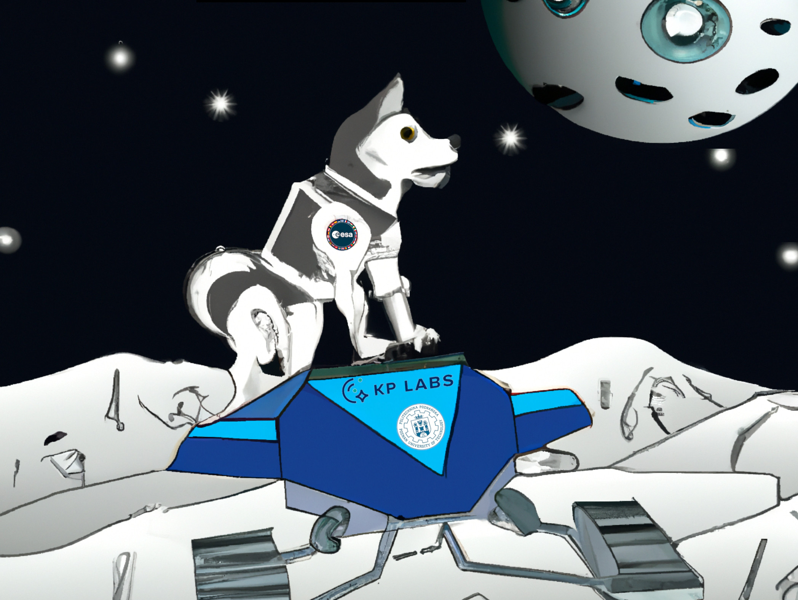

# ROS2 Foxy node for computer vision tasks inference on Versal VCK190 together with Husky Rover and OAK-D Lite depth camera

<div align="center">
  
 </div>

## Assumptions

The goal of Work Package 300 is to develop a framework that enables performing **deep learning inference** together with Robot Operating System (**ROS2**) directly on the Xilinx Versal **VCK190** developer board. Additionally, the framework can grab **color and depth** images from a commonly available sensor (in this case it is **Luxonis OAK-D Lite**) and publish them to ROS2 topics, and also can control the **Husky robot** using ROS2 messages.

## Hardware and software requirements

[TODO]

## Workflow

### Create project and developer board device configuration

The main part of this step is based on the [VCK190 Base TRD](https://xilinx.github.io/vck190-base-trd/2022.1/html/index.html) document. It contains all the necessary information about the VCK190 board and how to create a project for it with working DPU inference. Follow 1 to 4.4 steps from the document and then continue with the steps below to generate the Petalinux image and copy it to an SD card.

> Note, that `$WORKSPACE` variable is the path to the petalinux project directory generated inside `vck190-base-trd`. In our case it is `/home/put/Projects/vck190-base-trd/petalinux/xilinx-vck190-base-trd/`.

```bash
# COPY DEDICATED VCK190 FILES TO THE PROJECT
cp $WORKSPACE/../../overlays/xvdpu/kernels/binary_container_1.xsa $WORKSPACE/project-spec/hw-description/system.xsa
cp $WORKSPACE/../../overlays/xvdpu/kernels/binary_container_1.xclbin $WORKSPACE/images/linux/
cp -r $WORKSPACE/../../overlays/xvdpu/apps/*  $WORKSPACE/project-spec/meta-base-trd/recipes-apps

# BUILD PROJECT
petalinux-build

# GENERATE BOOT FILES
petalinux-package --boot --u-boot --dtb $WORKSPACE/images/linux/system.dtb --qemu-rootfs no --force

# GENERATE BOOT IMAGE
petalinux-package --wic --bootfiles "binary_container_1.xclbin ramdisk.cpio.gz.u-boot boot.scr Image BOOT.BIN"

# COPY BOOT IMAGE TO SD CARD
sudo dd if=$WORKSPACE/images/linux/petalinux-sdimage.wic of=<DEVICE> status=progress conv=sync
```

### Rootfs configuration

[TODO]

### Kernel configuration

Some changes in kernel modules are required to enable some USB features. You can edit it using `petalinux-config -c kernel` tool.

**Changes:**

 - Enable `CONFIG_USB_SERIAL_PL2303` module to enable Prolific USB-UART converter.

 - Enable `USB_SERIAL_XSENS_MT` module to enable Xsens MTi USB-UART converter.

 - Enable `INPUT_JOYSTICK` and `INPUT_JOYDEV` modules to activate joystick support. 

### Robot Operating System (ROS2-Foxy) configuration

> This part is mostly based on the [ROS 2 Humble Hawksbill with Yocto and PetaLinux](https://news.accelerationrobotics.com/ros2-humble-yocto-petalinux/) article.

**Steps:**  

- Clone modified `meta-ros` package:
    
    ```bash
    git clone https://github.com/PUTvision/put-meta-ros $WORKSPACE/project-spec/meta-ros
    ```

- Edit configuration file: `$WORKSPACE/build/conf/bblayers.conf` and add parts:

    - add headers: 
        ```bash
        # define the ROS 2 Yocto target release
        ROS_OE_RELEASE_SERIES = "honister"

        # define ROS 2 distro
        ROS_DISTRO = "foxy"
        ```

    - append sources:
        ```bash
        ${SDKBASEMETAPATH}/../../project-spec/meta-ros/meta-ros2-foxy \
        ${SDKBASEMETAPATH}/../../project-spec/meta-ros/meta-ros2 \
        ${SDKBASEMETAPATH}/../../project-spec/meta-ros/meta-ros-common \
        ```

- Create destination image directory:  
    ```bash
        mkdir -p  $WORKSPACE/project-spec/meta-user/recipes-images/images
    ```
    and copy our configuration file:  
    ```bash
        cp $WORKSPACE/project-spec/meta-ros/put_sources/petalinux-image-minimal.bbappend $WORKSPACE/project-spec/meta-user/recipes-images/images/`
    ```

### Application configuration

* Each layer below clone into the `$WORKSPACE/project-spec/meta-user/recipes-apps/` directory.

* Our application layers:

    - [put-meta-base-config](https://github.com/PUTvision/put-meta-base-config) - Base configuration containing common things like bashrc, etc.
    - [put-meta-depthai-core](https://github.com/PUTvision/put-meta-depthai-core) - DepthAI core package. Based on [depthai-core](https://github.com/luxonis/depthai-core) sources. It enables the usage of DepthAI API in C++ and Python. 
    - [put-meta-depthai-ros](https://github.com/PUTvision/put-meta-depthai-ros) - ROS bindings for DepthAI. Based on [depthai-ros/foxy](github.com/luxonis/depthai-ros) sources. It provides ROS2 nodes for DepthAI API.
    - [put-meta-husky](https://github.com/PUTvision/put-meta-husky) - Husky mobile robot package for Petalinux usage. Based on [husky/foxy-devel](https://github.com/husky/husky/tree/foxy-devel) package. 

### Onboard configuration

* Set bash as default shell (.bashrc and .bash_profile are used by default)

    ```bash
    chsh -s /bin/bash root
    ```

* Install inference engine lib

    ```bash
    git clone https://github.com/mwiejak-KP/cognition-xilinx-inference-runner.git
    cd cognition-xilinx-inference-runner/

    python3 xilinx_runner/setup.py install
    ```

* Create ROS2 inference engine node
    ```bash
    mkdir -p ~/ros2_ws/src
    cd ~/ros2_ws/src

    git clone https://github.com/PUTvision/ros2_fpga_inference_node.git inference_node/
    cd ~/ros2_ws

    colcon build
    source install/setup.bash
    ```

* Usage:
    ```bash
    # run husky node
    ros2 launch husky_base put_base.launch.py

    # run camera node
    ros2 launch depthai_cognition rgb_depth_publisher.launch.py

    # run inference engine
    ros2 run inference_node inference_engine 
    ```

## Acknowledge


**This work was funded by European Space Agency OSIP, PO number: 4000138073, COGNITION project.**
